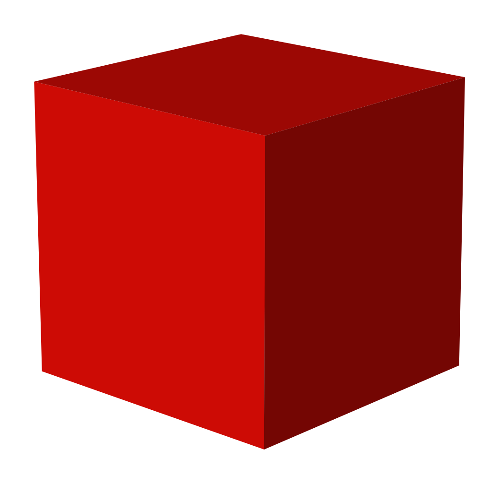

# 3D-CSS-Playground

3D CSS Playground is a free tool to create and configure different 3D shapes and embed the code directly into your own applications.

You can see it live in action here: [3D CSS Playground](https://dominicbisschop.github.io/3D-CSS-Playground/)
